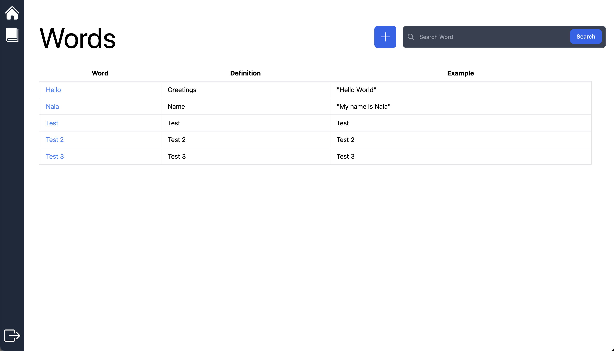

<h1 align="center">Study Buddy</h1>

<p align="center">
  
</p>

## Table of Contents

- [About the Project](#about-the-project)
- [Features](#features)
- [Getting Started](#getting-started)
  - [Prerequisites](#prerequisites)
  - [Installation](#installation)
- [Usage](#usage)
- [Technologies Used](#technologies-used)
- [Contributing](#contributing)
- [License](#license)

## About the Project

**Study Buddy** is a user-friendly dictionary application designed to help users search for word definitions and examples. It also allows users to contribute by adding new words to the dictionary.

### Key Features

- Search for word definitions.
- View example sentences for words.
- Contribute by adding new words and their definitions.
- User-friendly and responsive design.

## Dependencies and Technologies Used

Below is a list of the main dependencies and technologies used in this project:

- **Frontend:**
  - [React](https://reactjs.org/) - A JavaScript library for building user interfaces.
  - [Axios](https://axios-http.com/) - A promise-based HTTP client for making API requests.
  - [React Router](https://reactrouter.com/) - A library for routing in React applications.
  - [React Icons](https://react-icons.github.io/react-icons/) - A collection of popular icons for React applications.
  - [Toastify](https://fkhadra.github.io/react-toastify/introduction) - A library for adding toast notifications to your React app.

- **Backend:**
  - [Node.js](https://nodejs.org/) - A JavaScript runtime for building server-side applications.
  - [Express](https://expressjs.com/) - A web application framework for Node.js.
  - [MongoDB](https://www.mongodb.com/) - A NoSQL database for storing application data.
  - [Mongoose](https://mongoosejs.com/) - An ODM (Object Data Modeling) library for MongoDB.
  
- **Styling:**
  - [Tailwind CSS](https://tailwindcss.com/) - A utility-first CSS framework for quickly building custom designs.
  
- **Other Tools:**
  - [Git](https://git-scm.com/) - A distributed version control system.
  - [GitHub](https://github.com/) - A platform for hosting and collaborating on Git repositories.
  - [npm](https://www.npmjs.com/) - The package manager for JavaScript.
  - [Spotify](https://open.spotify.com/album/1xJHno7SmdVtZAtXbdbDZp?si=_q-qeTqZSWWdCuNWY21nAA) - GUTS by Olivia Rodrigo

Please note that this list includes the major dependencies and technologies


## Getting Started

### Prerequisites

Before you begin, ensure you have met the following requirements:

- [Node.js](https://nodejs.org/) installed.
- A running MongoDB server.

### Installation

1. Clone the repository:

   ```sh
   git clone https://github.com/your-username/dictionary-web-app.git
2. Client dependencies:

   ```sh
   cd client
   npm i
   npm run dev

3. Server dependencies:

   ```sh
   cd server
   npm i
   node server.js

4. .env:

   ```sh
   DATABASE_URL = MongoDBurl
   SECRET = (run in your terminal: openssl rand -hex 32)


### In The Future
1. Work on relational data so multiple users can have unique dictionaries
2. Tag feature - user can add max 3 tags to each word
3. Multiple dictionary per user capability 
4. Home Page will have a digital planner
5. ChatBot